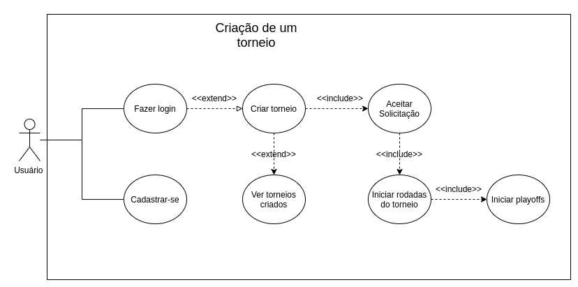

# Documento de Arquitetura de Software (DAS)

# "Ibmec Monitoria"

# Introdução

## Proposta

Este documento apresenta uma visão geral da arquitetura do sistema, utilizando diferentes visões arquiteturais para destacar os principais aspectos do aplicativo.
O objetivo é capturar as decisões arquiteturais significativas que fizeram parte do projeto, servindo como guia para desenvolvimento, manutenção e evolução futura da aplicação.

## Escopo

A aplicação **Ibmec Monitoria** foi desenvolvida para atender às necessidades acadêmicas de alunos e monitores da instituição, oferecendo um ambiente digital que centraliza a organização de monitorias, permitindo agendamento, comunicação e acompanhamento de atividades.

## Definições, Acrônimos e Abreviações

- MVC - Model-View-Controller: padrão de arquitetura que separa a aplicação em três camadas principais (modelo, visão e controle).
- MVT - Model-View-Template: padrão de arquitetura utilizado em frameworks como Django, no qual a camada de template substitui a visão do MVC tradicional.
- SIGLA PARA O APP - Nome do Aplicativo

## Visão Geral

O Documento de Arquitetura de Software (DAS) trata-se de uma visão geral de toda a arquitetura do sistema, observando diferentes aspectos do mesmo. Neste documento serão abordadas as seguintes visões da aplicação TCM:

- Caso de Uso;
- Lógica;
- Implantação;
- Implementação;
- Dados;

# Representação Arquitetural

## Cliente-Servidor

O modelo Cliente-Servidor é utilizado como base da arquitetura do aplicativo **Ibmec Monitoria**.  
Neste modelo, o **cliente (frontend)** é responsável pela interface e interação com o usuário, enquanto o **servidor (backend)** gerencia a lógica de negócio, persistência e comunicação com o banco de dados.

Cliente (Frontend):

- View: Consiste na interface gráfica do usuário, implementada em frameworks modernos (ex.: React Native ou Flutter para mobile e React.js para web).  
  Responsável por exibir os dados, coletar entradas do usuário e enviar requisições ao servidor.

Servidor (Backend):

- Controller: Realiza a conexão entre as camadas, recebendo requisições do cliente e direcionando para os serviços adequados.
- Service: Responsável pela lógica de negócio da aplicação, como agendamento de monitorias, autenticação de usuários e gestão de notificações.  
- Model: Responsável pela persistência dos dados, incluindo armazenamento e recuperação em banco de dados relacional (ex.: PostgreSQL ou MySQL).

# Objetivos de Arquitetura e Restrições

## Objetivos

Segurança:
   - Utilização de autenticação via token (JWT) e criptografia para proteger dados sensíveis (como senhas e informações pessoais dos usuários).
Persistência:
   - Armazenamento confiável em banco de dados relacional (PostgreSQL), garantindo consistência e integridade das informações sobre alunos, monitores e agendamentos.
Privacidade:
   - Uso de middlewares de autenticação e autorização para controlar acesso, assegurando que apenas usuários autorizados possam visualizar e editar informações.
Desempenho:
   Requisições otimizadas por meio de API RESTful, com uso de cache e paginação para reduzir carga no servidor e melhorar o tempo de resposta.
Reusabilidade:
   Componentes no frontend desenvolvidos em React Native e React.js de forma modular, permitindo reaproveitamento em diferentes telas do aplicativo.

## Restrições

Tamanho da tela:...

Portabilidade:...

| IE | Edge  | Firefox | Chrome | Safari | Googlebot |
| -- | ----- | ------- | ------ | ------ | --------- |
| 11 | >= 14 | >= 52   | >= 49  | >= 10  | Sim       |

Serviços: Os serviços oferecidos....

Acesso a internet: A aplicação está limitada apenas a conexão com internet

## Ferramentas Utilizadas

- XXX: Ambiente de execução...
- XXXX: Linguagem de programação...
  Typescript: XXXX
- XXXX: XXXX
- XXX: XXXX
- XXXX: XXXX
- XXXX: XXXX
- XXXX: XXXX
- XXXXX: XXXX.

# Visão de Caso de Uso

O primeiro caso de uso descreve a ação...

# Visão Lógica

# Visão de Implantação

# Visão de Implementação

## Visão Geral

# Visão de Dados

## Modelo Entidade Relacionamento (MER)

#### Entidades e Relacionamentos:

## Diagrama Entidade Relacionamento (DER)

# Tamanho e Desempenho

# Qualidade

# Referências Bibliográficas

# Histórico de Versão

| Data       | Versão | Descrição                                                            | Autor(es)                                   |
| ---------- | ------- | ---------------------------------------------------------------------- | ------------------------------------------- |
| 08/11/2020 | 1.0     | Criada estrutura básica do documento                                  | xxx xxx, xxx xx, xxx xx, xxx xxx e xxx xxxx |
| 15/11/2020 | 1.1     | Representação arquitetural e objetivos e restrições arquiteturais. | Autores                                     |
| 19/11/2020 | 1.2     | Adição dos diagramas, visões, tamanho e desempenho e qualidade      | Autores                                     |
| 20/11/2020 | 1.3     | Adição da descrição de MER e DER                                   | Autores                                     |
| 20/11/2020 | 1.4     | Adição do tópico de qualidade                                       | Autores                                     |
| 20/11/2020 | 1.5     | Revisão                                                               | Autores                                     |
